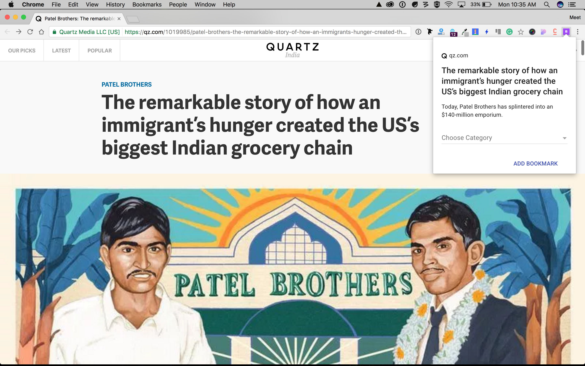

  <h1>
    Bookmark Cross Browser Extension
  </h1>

  

    <strong>A cross browser extension to make bookmarking easy and easily sync with <a href="https://github.com/mrgodhani/bookmark">Bookmark</a> desktop application.</strong>
  

## Installation
1. Clone the repository `git clone https://github.com/EmailThis/extension-boilerplate.git`
2. Run `npm install`
3. Run `npm run build`

##### Load the extension in Chrome & Opera
1. Open Chrome/Opera browser and navigate to chrome://extensions
2. Select "Developer Mode" and then click "Load unpacked extension..."
3. From the file browser, choose to `extension-boilerplate/build/chrome` or (`extension-boilerplate/build/opera`)

##### Load the extension in Firefox
1. Open Firefox browser and navigate to about:debugging
2. Click "Load Temporary Add-on" and from the file browser, choose `extension-boilerplate/build/firefox`

## Developing
The following tasks can be used when you want to start developing the extension and want to enable live reload - 

- `npm run chrome-watch`
- `npm run opera-watch`
- `npm run firefox-watch`

## Packaging
Run `npm run dist` to create a zipped, production-ready extension for each browser. You can then upload that to the appstore.
